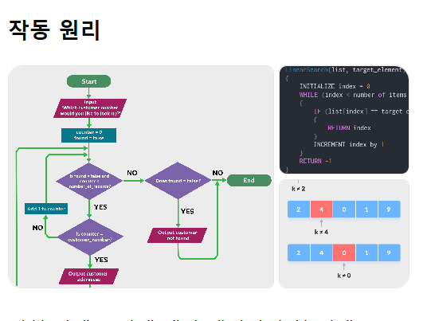

# 선형탐색 (Linear Search)

## 개념
선형탐색은 데이터가 정렬되어 있지 않아도 사용할 수 있는 가장 단순한 탐색 방법이다. 앞에서부터 하나씩 순차적으로 비교하면서 목표 값을 찾는다.

## 동작 방식
1. 첫 번째 원소부터 시작한다.
2. 현재 원소가 목표 값과 같은지 비교한다.
3. 같으면 인덱스를 반환하고 종료한다.
4. 끝까지 못 찾으면 실패(-1 또는 null 등)를 반환한다.

## 작동 원리 (도식)


## 작동 원리 (설명)
- 시작 시 인덱스를 0으로 둔다.
- 배열 끝에 도달할 때까지 반복하며 현재 값과 목표 값을 비교한다.
- 값이 같으면 해당 인덱스를 반환하고 종료한다.
- 같지 않으면 인덱스를 1 증가시켜 다음 원소로 이동한다.
- 끝까지 찾지 못하면 실패로 처리한다.

## 시간 복잡도
- 최선: O(1) (첫 원소에서 찾는 경우)
- 평균: O(n)
- 최악: O(n) (끝까지 찾거나 없는 경우)

## 공간 복잡도
- O(1) (추가 메모리 거의 없음)

## 언제 사용하나
- 데이터 크기가 작을 때
- 정렬되지 않은 데이터에서 간단하게 찾고 싶을 때
- 구현 비용이 매우 낮아야 할 때

## 간단한 의사코드
```
for i in 0..n-1:
  if a[i] == target:
    return i
return -1
```

## Java 예제
```java
public static int linearSearch(int[] arr, int target) {
    for (int i = 0; i < arr.length; i++) {
        if (arr[i] == target) {
            return i;
        }
    }
    return -1; // 못 찾으면 -1
}
```

## 사용 예시
```java
int[] data = {2, 4, 0, 1, 9};
int idx = linearSearch(data, 1); // 결과: 3
int missing = linearSearch(data, 7); // 결과: -1
```

## 주의할 점
- 중복 값이 있으면 첫 번째로 발견된 인덱스를 반환한다.
- 비어 있는 배열이면 바로 -1을 반환한다.

## 장단점
장점:
- 구현이 쉽다
- 정렬이 필요 없다
- 어떤 자료구조에도 적용 가능

단점:
- 데이터가 커질수록 느리다
- 반복 탐색에는 비효율적이다

## 참고
정렬된 배열에서 반복 탐색이 많다면 이진탐색을 고려하는 것이 일반적이다.
